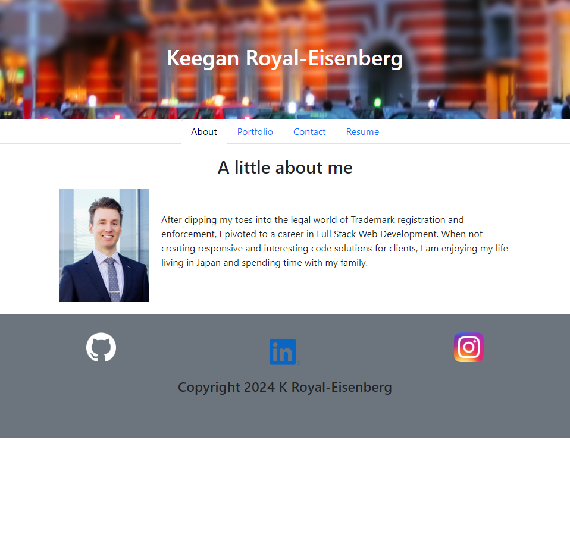

# Portfolio

## Description

This is my online portfolio page. I began it during a bootcamp that i particpated in during the Winter or 2023 and the Spring of 2024.

## Table of Contents

-   [Introduction](#introduction)
-   [Problem](#problem)
-   [Solution](#solution)
-   [Contributors](#contributors)
-   [Contact](#contact)
-   [License](#license)

## Introduction

The client, an employer looking for candidates with experience building single-page applications, would to to view a potential employee's deployed React portfolio of work samples, so that they can assess whether they're a good candidate for an open position.

## Problem

Given a single-page application portfolio for a web developer, when the portfolio is loaded, the user is presented with a page containing a header, a section for content, and a footer.

When the user views the header, they see the developer's name and navigation titles corresponding to different sections of the portfolio.

Viewing the navigation titles, the user is presented with the titles "About Me", "Portfolio", "Contact", and "Resume". The title corresponding to the current section is highlighted.

When the user clicks on a navigation title, the browser URL changes, the corresponding section is displayed below the navigation, and that title is highlighted.

On loading the portfolio for the first time, the "About Me" title and section are selected by default.

When the user is presented with the "About Me" section, they see a recent photo or avatar of the developer and a short bio about them.

In the "Portfolio" section, the user sees titled images of six of the developer’s applications, with links to both the deployed applications and the corresponding GitHub repositories.

The "Contact" section presents the user with a contact form containing fields for a name, an email address, and a message.

If the user moves their cursor out of one of the form fields without entering text, they receive a notification that this field is required.

When the user enters text into the email address field, they receive a notification if they have entered an invalid email address.

In the "Resume" section, the user sees a link to a downloadable resume and a list of the developer’s proficiencies.

When the user views the footer, they are presented with text or icon links to the developer’s GitHub and LinkedIn profiles, as well as their profile on a third platform (e.g., Stack Overflow or Twitter).

## Solution

Here is link to the deployed application on Netlify:
[Link to deployed app](https://ktetsuyama.netlify.app/)

and here is a screenshot:

## Contributors

I used chatgpt and Github copilot to troubleshoot bugs.

## Contact

You can contact me here is you have questions:

Github: [ktetsuyama](https://github.com/ktetsuyama)

Email: [kroyal.eisenberg@gmail.com](mailto:kroyal.eisenberg@gmail.com)

## License

This project is covered under the 

Learn more about this license [here](https://opensource.org/licenses/MIT).

Thank you for reading.
